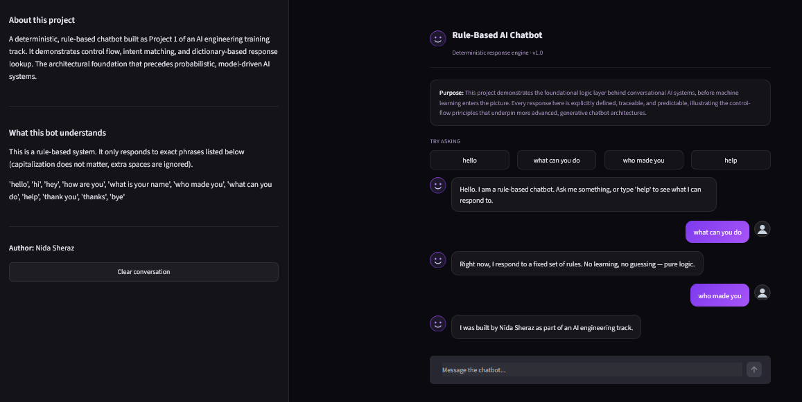

# Rule-Based AI Chatbot

A deterministic, rule-based chatbot demonstrating control flow, intent matching, and dictionary-based (O(1)) response lookup — the foundational logic layer behind conversational AI systems, before machine learning enters the picture. Built as Project 1 of an AI Engineering training track.



## Purpose

Every response in this system is explicitly defined, traceable, and predictable — a deterministic "white box" architecture. This project establishes the control-flow foundation that underpins more advanced, generative chatbot systems.

## Features

- Continuous conversation loop with graceful exit handling
- Case and whitespace-insensitive input sanitization
- Dictionary-based intent matching (O(1) lookup)
- Fallback response for unrecognized input
- Two implementations: command-line (Python) and web interface (Streamlit)
- Custom dark UI

## Tech Stack

- Python 3.11
- Streamlit (web interface)
- Pillow (dynamic favicon generation)

## Project Structure
rule-based-ai-chatbot/
├── chatbot.py # Core CLI chatbot logic
├── test_chatbot.py # Unit tests
├── requirements.txt
├── streamlit_app/
│ └── app.py # Web interface
├── assets/
│ └── screenshots/
├── README.md
├── LICENSE
└── .gitignore
## Run Locally

### CLI version
```bash
python chatbot.py
```

### Web version
```bash
pip install -r requirements.txt
streamlit run streamlit_app/app.py
```

## Testing
```bash
python -m unittest test_chatbot.py -v
```

## Roadmap

- [x] CLI version
- [x] Unit tests
- [x] Web interface (Streamlit)

## Author

Nida Sheraz